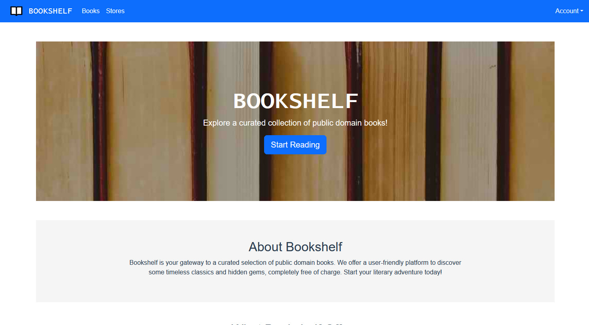

# Bookshelf

     

[](https://github.com/f4rys/Bookshelf/actions/workflows/node.js.yml) [](https://github.com/f4rys/Bookshelf/actions/workflows/codeql.yml)

This public domain book reader is a web app project completed as part of the Mobile Systems Programming course at Kraków University of Economics. The goal was to apply knowledge of mobile development principles and web technologies to create a functional and user-friendly reading experience. This project serves as a practical example of how mobile systems can be used to provide access to literature.

**A Friendly Note:**

This project is for learning purposes and contains Firebase secrets (like API keys) that are meant to be kept private. Please be kind and avoid using these secrets for anything other than exploring the project's code. Using them in a real-world context could potentially cause issues with my Firebase project.



# Overview
**App**
- Bookshelf is SPA thanks to the use of the Vue.js framework.
- It is PWA, can be downloaded and installed.
- It is hosted on Firebase Hosting.
- Application layout is responsive and both desktop and mobile-friendly thanks to the use of the Bootstrap.
- It uses 3 collection of documents stored in Firebase DB that stores information about books, users and bookstores.

**Books**
- Possibility to view books loaded from Firebase Storage for logged in and not logged in users.
- Logged in users can add to and remove books from their favourites list.
- Device vibrates as the user adds to or removes book from their favourites list.
- Logged in users have their progress in book saved in database. The book always opens where the user finished reading last time.

**Stores**
- A map of bookstores in Krakow built with Leaflet.js.
- User can find their current GPS location. It is marked on a map.

**Login and signup**
- Authentication system is built with the help of Firebase services.
- It allows to create account with email and password or log in with Google account.
- Account dropdown menu has a button to log out.

**Profile**
- User can see their username and email
- User can also set and change their avatar. The files are stored via Firebase Storage.
- A new avatar can be set by selecting a photo in user device's image picker or by accessing their camera and taking photo.

# Use case diagram


## Run locally

1. **Clone the Repository:**
   ```bash
   git clone https://github.com/f4rys/Bookshelf

2. **Install dependencies and run:**
   ```bash
   npm install
   npm run serve
4. **Open in browser:**
   ```bash
   http://localhost:8080/

# Credits
- Home page banner image by <a href="https://www.pexels.com/pl-pl/@emily-252615/">Emily</a> on <a href="https://www.pexels.com/pl-pl/zdjecie/ksiazki-768125/">Pexels