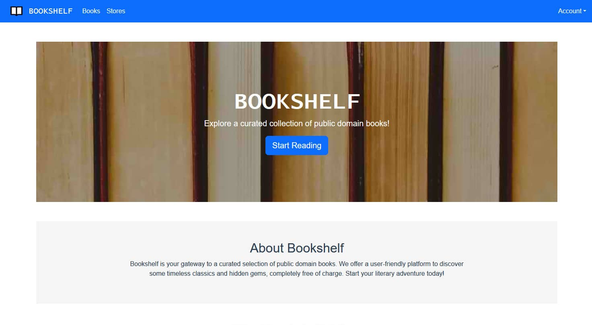
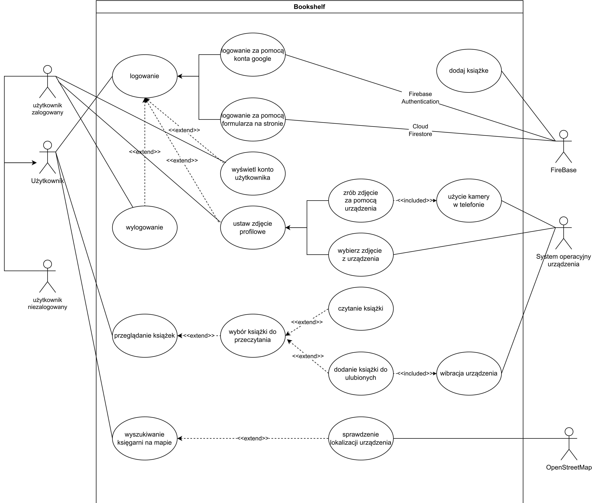

# Bookshelf

     

[](https://github.com/f4rys/Bookshelf/actions/workflows/node.js.yml) [](https://github.com/f4rys/Bookshelf/actions/workflows/codeql.yml) 

This public domain book reader is a web app project completed as part of the Mobile Systems Programming course at Kraków University of Economics. The goal was to apply knowledge of mobile development principles and web technologies to create a functional and user-friendly reading experience. This project serves as a practical example of how web technologies can be used to provide access to literature.

**A Friendly Note:**

This project is for learning purposes and contains Firebase secrets (like API keys) that are meant to be kept private. Please be kind and avoid using these secrets for anything other than exploring the project's code. Using them in a real-world context could potentially cause issues with my Firebase project.



# Overview

Bookshelf is a Single Page Application (SPA) built with the Vue.js framework, offering a seamless user experience. As a Progressive Web App (PWA), it can be installed on mobile devices and is hosted on Firebase Hosting for reliability and scalability. 

The application boasts a responsive layout optimized for both desktop and mobile devices, thanks to the use of Bootstrap. It leverages Firebase's NoSQL database to manage three key data collections: books, users, and bookstores.

**Book Features**

* **Universal book access:** Both logged-in and guest users can view books, which are loaded from Firebase Storage.
* **Favorites management:**  Logged-in users can curate a personalized list of favorite books, with haptic feedback (device vibration) provided for each addition or removal.
* **Reading progress synchronization:** User reading progress is automatically saved in the database, ensuring that books open to the last page read on any device.

**Store Locator**

* **Interactive map:** An integrated map, powered by Leaflet.js, displays selected bookstores in Kraków. 
* **User geolocation:** Users can pinpoint their current location on the map using GPS.

**Authentication & Profile**

* **Firebase authentication:** A robust authentication system, built with Firebase, supports email/password registration and login, as well as Google account integration.
* **Account management:** Users can view their profile information.
* **Avatar customization:** Avatars can be updated by selecting an existing photo from the user's device or by capturing a new image with the device's camera.

# Use case diagram



# Run locally

1. **Clone the Repository:**
   ```bash
   git clone https://github.com/f4rys/Bookshelf

2. **Install dependencies and run:**
   ```bash
   npm install
   npm run serve
4. **Open in browser:**
   ```bash
   http://localhost:8080/
   ```

# Contributors

<table>
<tr>
    <td align="center" style="word-wrap: break-word; width: 60; height: 70">
        <a href=https://github.com/Kichote>
            
            <br />
            <sub style="font-size:14px"><b>Kichote</b></sub>
        </a>
    </td>
    <td align="center" style="word-wrap: break-word; width: 60; height:70">
        <a href=https://github.com/LukaszCheciak>
            
            <br />
            <sub style="font-size:14px"><b>LukaszCheciak</b></sub>
        </a>
    </td>
</tr>
</table>

# Credits
- Home page banner image by <a href="https://www.pexels.com/pl-pl/@emily-252615/">Emily</a> on <a href="https://www.pexels.com/pl-pl/zdjecie/ksiazki-768125/">Pexels
- 
